# kotlin_android_programing
Mobile Device Programing Distance Education

# Screenshots

<h2>Lab 6</h2>

Screenshot1             |  Screenshot2   |  Screenshot3
:-------------------------:|:-------------------------:|:-------------------------:
 |  | 

Screenshot4             |  Screenshot5   |  Screenshot6
:-------------------------:|:-------------------------:|:-------------------------:
 |  | 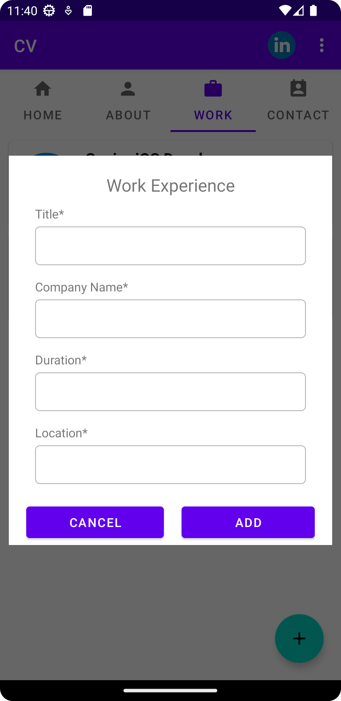

Screenshot7             |  Screenshot8   
:-------------------------:|:-------------------------:
 |  

<h2>Lab 5</h2>
<h3> Problem 1 </h3>

Screenshot1             |  Screenshot2   | 
:-------------------------:|:-------------------------:
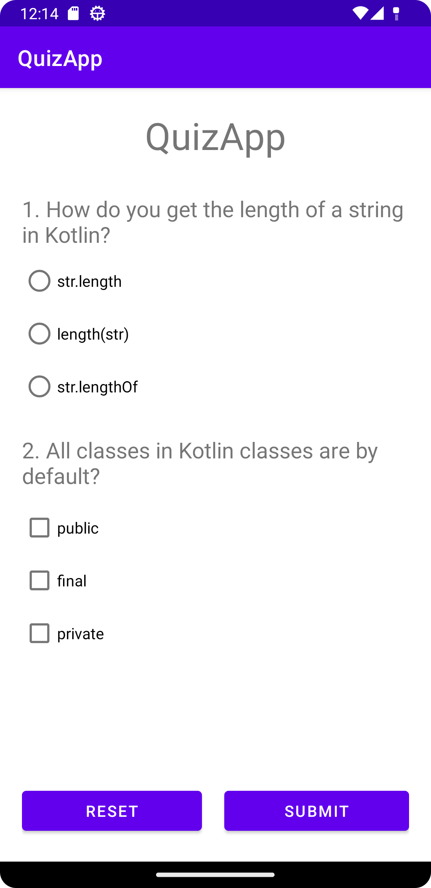 | 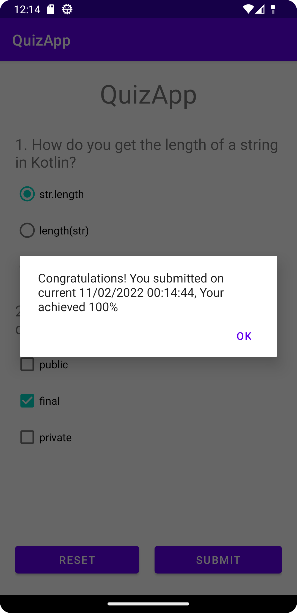 

<h3> Problem 2 </h3>

Screenshot1             |  Screenshot2   
:-------------------------:|:-------------------------:
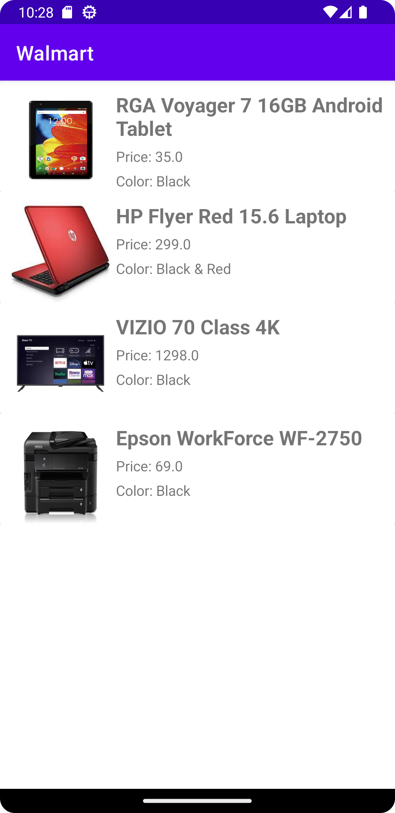 | 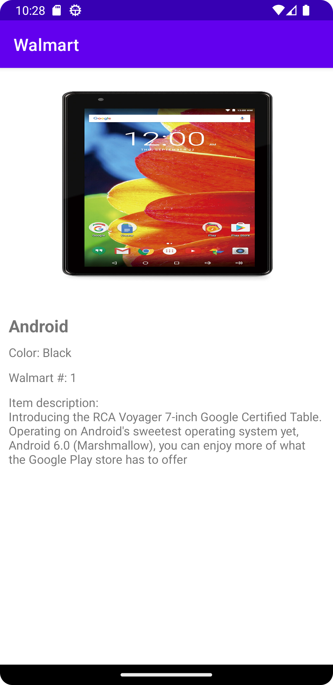 

<h2>Lab 4</h2>

Screenshot1             |  Screenshot2   |  Screenshot3
:-------------------------:|:-------------------------:|:-------------------------:
 | 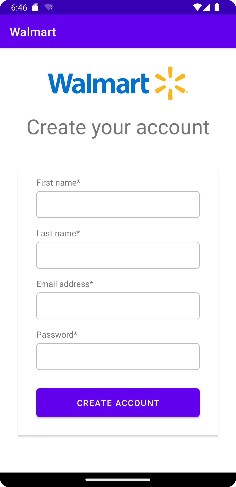 | 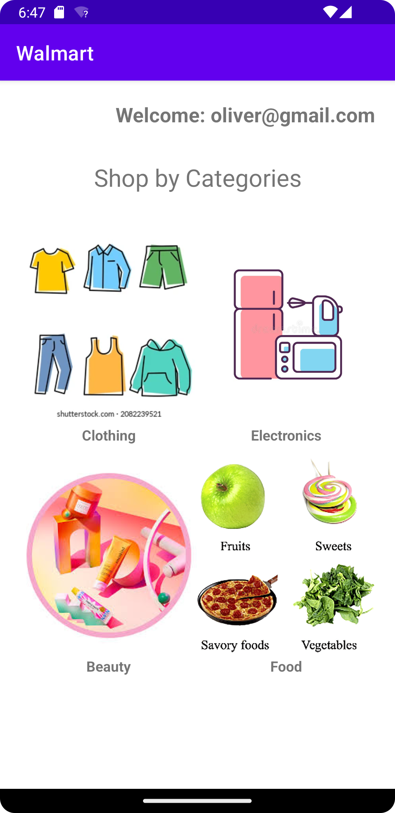

<h2>Lab 3</h2>
<h3> Problem 1 </h3>

Screenshot1             |  Screenshot2   |  Screenshot3
:-------------------------:|:-------------------------:|:-------------------------:
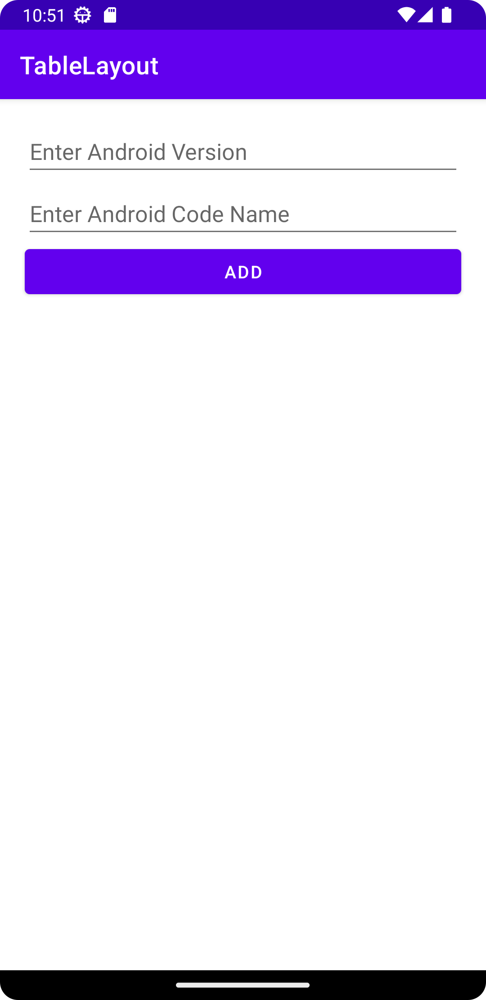 | 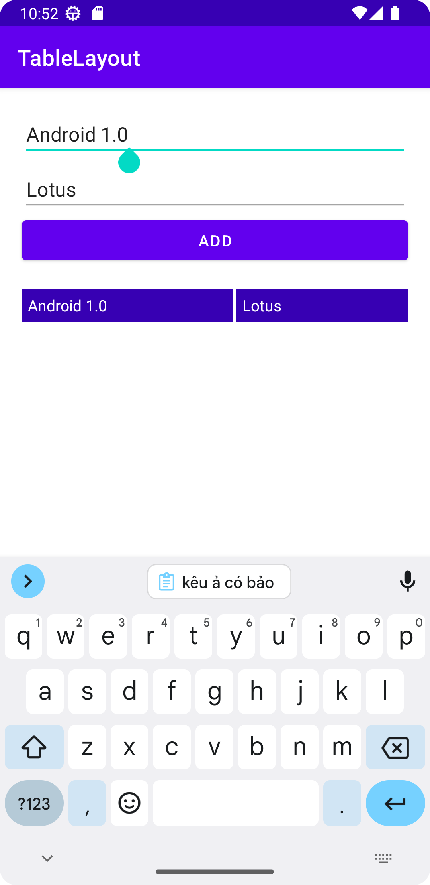 | 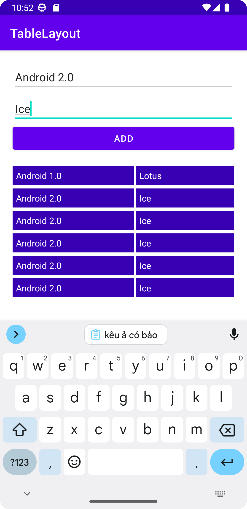

<h3> Problem 2 </h3>

Screenshot1             |  Screenshot2   
:-------------------------:|:-------------------------:
 |  

<h2>Lab 2</h2>
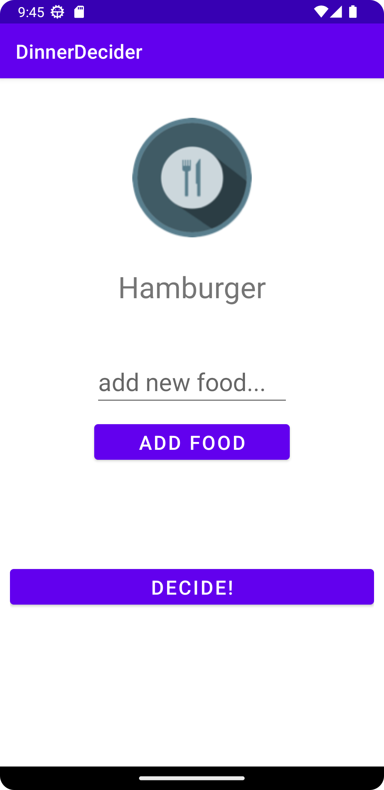

