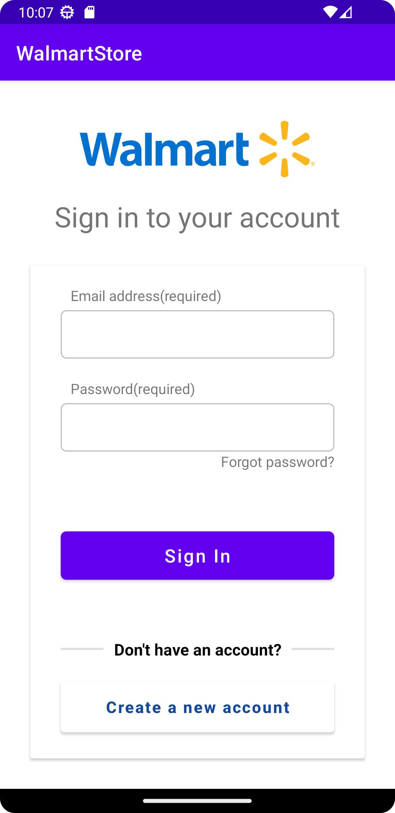
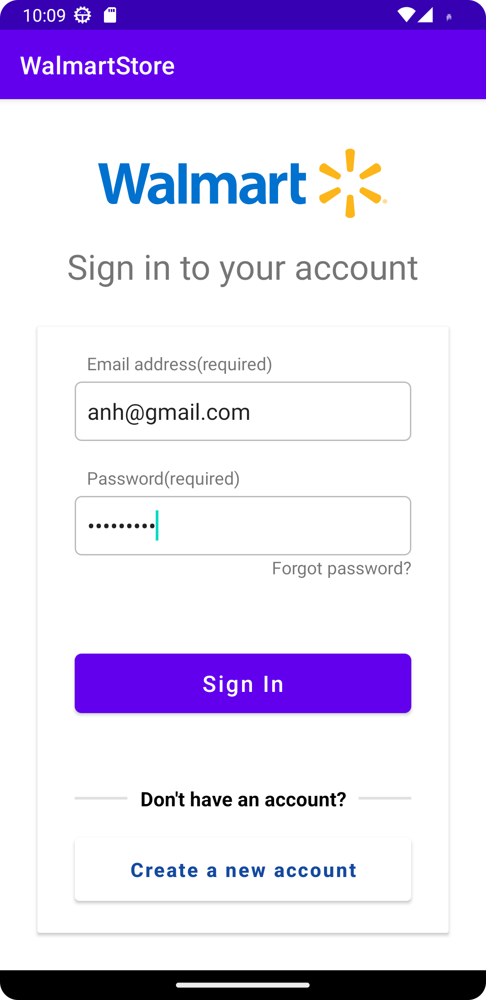

# kotlin_android_programing
Mobile Device Programing Distance Education

# Screenshots
<h2>Lab 2</h2>

<h2>Lab 3</h2>
<h3> Problem 1 </h3>

Screenshot1             |  Screenshot2   |  Screenshot3
:-------------------------:|:-------------------------:|:-------------------------:
 |  | 

<h3> Problem 2 </h3>

Screenshot1             |  Screenshot2   
:-------------------------:|:-------------------------:
 |  
